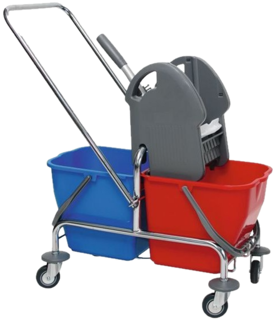

<p align="center">
  
</p>

# SlideMob

SlideMob is a professional tool designed to interact with PowerPoint files, enabling complex processing tasks like translation, stylistic polishing, and content extraction while strictly preserving the original presentation layout and formatting.

## Requisites

To run SlideMob from source or develop for it, ensure you have the following installed:

- Python: Version 3.11 or higher (but below 3.15).
- Poetry: For dependency management and virtual environment handling.
- Tkinter: Required for the GUI. On macOS, this can be installed via Homebrew:
  ```bash
  brew install python-tk
  ```
- LM Studio (Optional): Required if you intend to use local Large Language Models for translation or mapping.

## Installation and Setup

1. Clone the repository and enter the project root:
   ```bash
   cd slidemob/
   ```

2. Install dependencies using Poetry:
   ```bash
   poetry install
   ```

3. Activate the virtual environment:
   ```bash
   poetry shell
   ```

4. Run the application:
   ```bash
   poetry run slidemob
   ```

## Functional Overview

SlideMob provides a comprehensive suite of processing options for PowerPoint presentations:

- Extract PPTX: Parses the presentation and extracts text content into a structured format for processing.
- Pre Merge: Intelligently merges fragmented text runs within PowerPoint shapes. This is highly recommended to improve translation quality and maintain stylistic consistency.
- Polish Content: Uses LLMs to improve the writing style, grammar, and professional tone of the presentation.
- Translate Content: Translates all extracted text into your target language while preserving the exact layout position and formatting.
- Update PPTX Language: Syncs PowerPoint's internal language metadata with the translated content.
- Reduce Slides: Optional optimization to streamline processing by identifying redundant elements.

## Translation Strategies

SlideMob offers two distinct translation strategies selectable in the Settings:

- Classic: The standard method that process text segments individually. It is reliable for most standard layouts.
- Marker-based: A specialized method that uses temporary markers to handle complex slides with mixed formatting and nested styles more effectively.

You can package SlideMob into a standalone executable for macOS or Windows using the provided build script:

**macOS:**
```bash
```

**Windows:**
```bash
poetry run python scripts/build_executable.py --platform win
```

The resulting application will be located in the `dist/` folder.

## Model Selection and Configuration

SlideMob is model-agnostic and supports various Large Language Model providers. You can configure these by clicking the Settings (gear) icon in the top right of the GUI:

- OpenAI: Support for GPT-4 and GPT-3.5 models (requires an API key).
- DeepSeek: High-performance alternatives like deepseek-chat.
- Azure OpenAI: Enterprise-grade integration using your Azure endpoints.
- Hugging Face: Connect to various open-source models hosted via Hugging Face Inference API.
- LM Studio: Local model execution for maximum privacy and zero API costs.
- Argos Translate: A fully offline, open-source translation library running locally on your device.

## Argos Translate Setup (Offline Translation)

SlideMob now includes support for fully offline translation using Argos Translate. This method runs entirely on your local machine and requires no internet connection after the initial setup.

### Initial Setup
1. Open SlideMob.
2. Go to the **Configuration** tab.
3. Select **Argos Translate** as the Translation Method.
4. Click the **"Install/Update Language Packs"** button.
5. This will automatically download and install the following language pairs (approx. 1GB download):
   - English ↔ German
   - English ↔ French
   - English ↔ Spanish
   - English ↔ Portuguese
   - English ↔ Ukrainian
   - German ↔ French
   - German ↔ Ukrainian

### Adding More Languages
To add additional language pairs beyond the defaults:

1. You can manually install packages using Python code or by extending the `install_argos_languages` method in `src/slidemob/core_functions/translator.py`.
2. Alternatively, you can use the command line if you have `argostranslate` installed globally:
   ```bash
   argospm install from_code to_code
   ```
   For example, to add Italian to English:
   ```bash
   argospm install it en
   ```
3. Restart SlideMob after installing new languages.

## LM Studio Integration

SlideMob integrates seamlessly with LM Studio to provide local processing capabilities.

1. Setup LM Studio: Download and install LM Studio from their official website.
2. Install CLI (Optional but recommended):
   ```bash
   npx lmstudio install-cli
   ```
3. Start the Server: Open LM Studio and start the Local Inference Server (usually on port 1234).
4. Load a Model: Ensure a vision-capable or text model is loaded and active in LM Studio.
5. Configure SlideMob: 
   - Open Settings in SlideMob.
   - Select "LMStudio" as the Translation or Mapping method.
   - Ensure the Server URL matches (default is `http://localhost:1234`).
   - Enter the exact Model Name as it appears in LM Studio.

## Authors and Acknowledgments

SlideMob was developed by Jan Werth.
